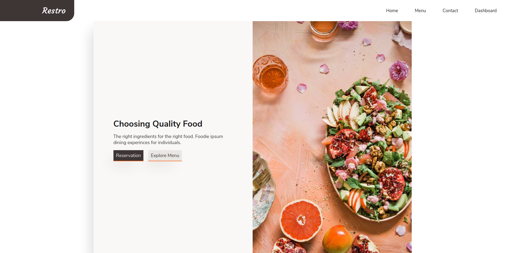

# Restro

Fully responsive restaurant web app using Gatsby.js, where customer can create reservation to the restaurant. There is also a dashboard panel for restaurant staff in `/admin` to manage reservations.

## Demo

[Live version on Netifly](https://restro-mediterranean.netlify.app/)

### Available Paths/Routes

- `/menu`
- `/login`
- `/admin`

## Table of contents

- [Getting Started](https://github.com/joedravarol/restro#getting-started)
- [Built With](https://github.com/joedravarol/restro#built-with)
- [Contributors](https://github.com/joedravarol/restro#contributors)
- [License](https://github.com/joedravarol/restro#license)
- [Acknowledgement](https://github.com/joedravarol/restro#acknowledgement)

## Getting Started

These instructions will get you a copy of the project up and running on your local machine for development and testing purposes.

### Prerequisite

- Node.js
- Npm
- Gatsby cli

### Installing

1. Fork this repository on Github.
1. Clone your forked repository onto your local computer.
1. Use `$ cd restro` to move into the project directory.
1. Create a Firebase project for web application at [https://firebase.google.com/](https://firebase.google.com/) by clicking `Get started`.
1. Create `.env.development` file and paste your Firebase credentials. You can see how to name the env variables in `firebase.js` file.
1. `$ npm install` to install the required dependencies.
1. `$ gatsby develop` to run a local development server.
1. Explore and enjoy!

## Built with

- Gatsby.js
- Scss
- Firebase Firestore
- Firebase Functions
- Continuous deployment with Netifly
- Prettier
- ESLint

## Contributors

- **Joe Lee** - Initial work

## License

This project is licensed under the MIT license - see the [LICENSE](LICENSE) file for details

## Acknowledgement

- [Brooke Lark](http://brookelark.com/) - Images on [Unsplash](https://unsplash.com/@brookelark)
- [Ofspace Team](https://dribbble.com/ofspacedesign) - [Design Inspiration](https://dribbble.com/shots/5480149-Cafe-Bistro-Restaurant-landing-page)
- [Saiful Khan](https://dribbble.com/saifulkhan6) - [Design Inspiration](https://dribbble.com/shots/6114960-Food-Restaurant-Landing-Page)
- [Fabiane Molon](https://dribbble.com/fabianemolon) - [Design Inspiration](https://dribbble.com/shots/6848780-The-Brekky)
- [Cody Ogden](https://codyogden.com/) - [Loader](https://codepen.io/codyogden/pen/qxjKKy)
